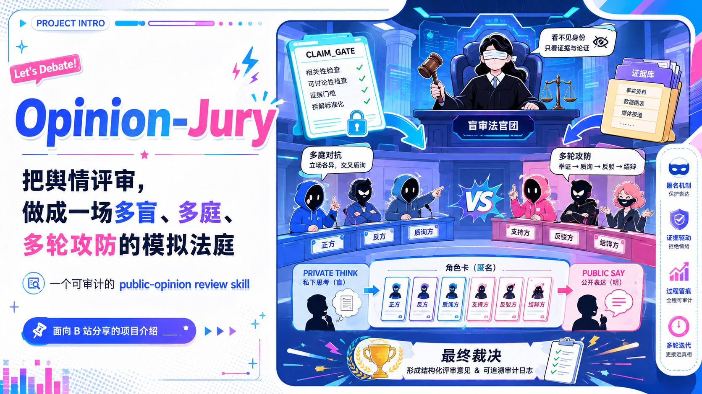
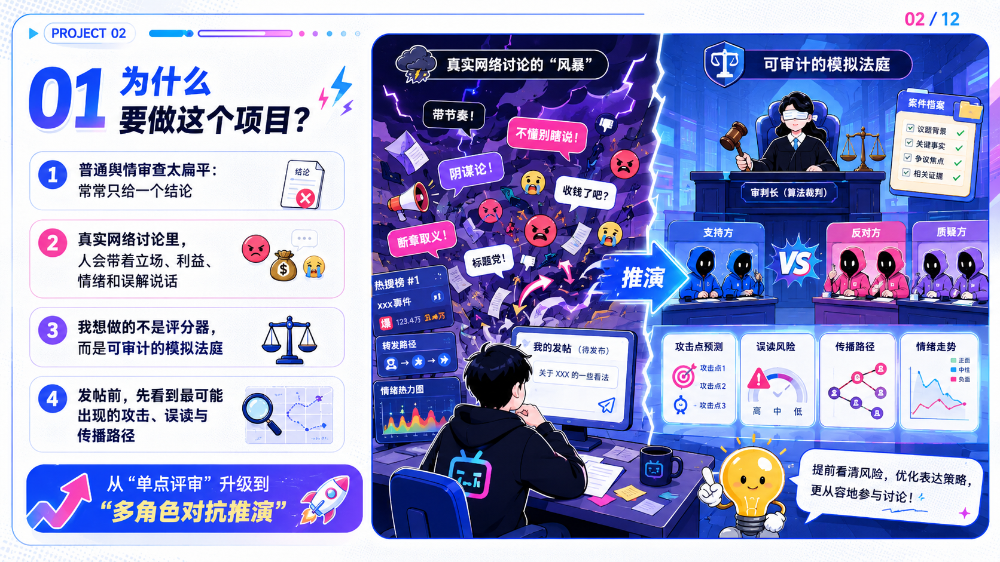
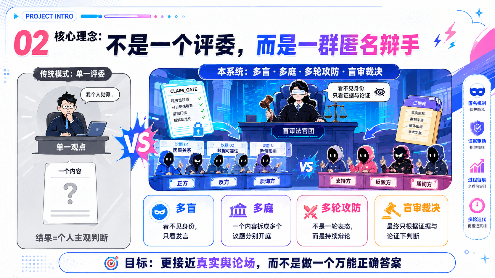
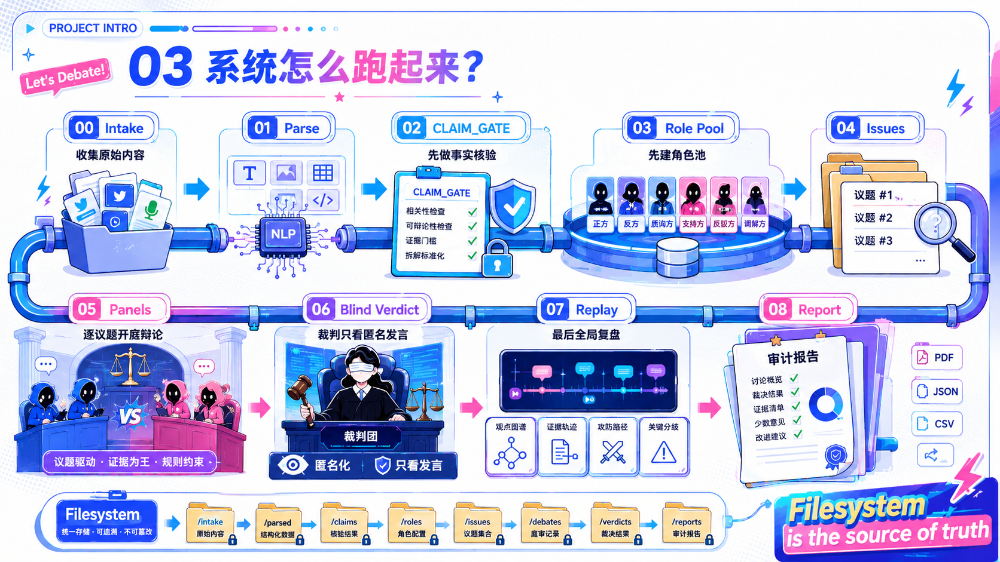
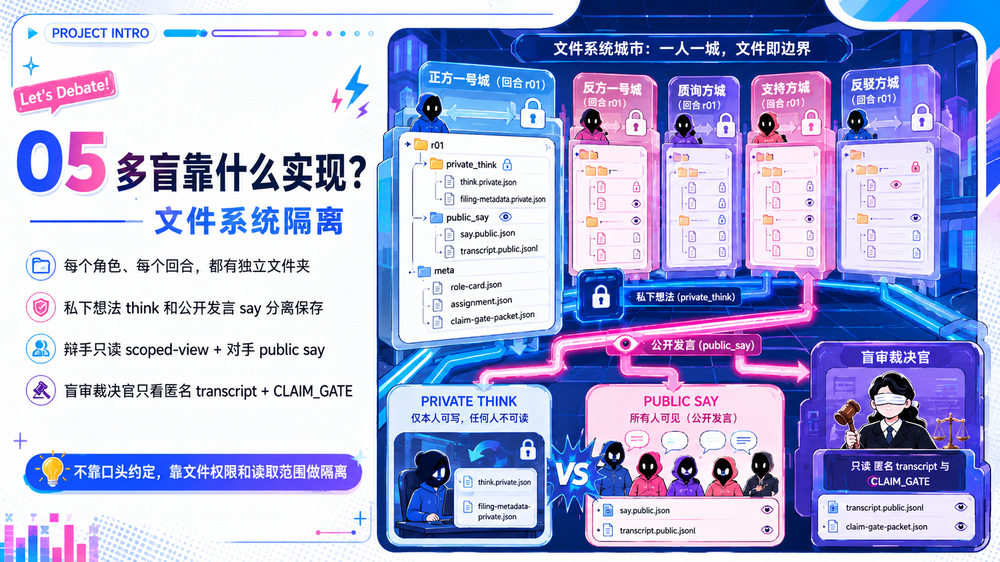
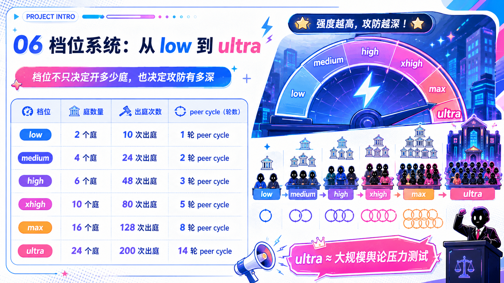
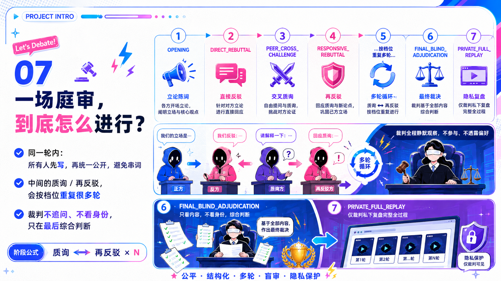

<p align="center">
  
</p>

<h1 align="center">⚖️ Opinion Jury</h1>

<p align="center">
  <strong>Auditable Multi-Blind Public-Opinion Review & Behavioral Reaction Simulation</strong><br>
  <a href="README.md">中文文档</a> | English
</p>

<p align="center">
  <a href="#intensity-levels">8 Intensity Levels</a> ·
  <a href="#multi-blind-architecture">Multi-Blind Isolation</a> ·
  <a href="#role-design-system">Factorized Roles</a> ·
  <a href="#think--say-separation-protocol">Think/Say Split</a> ·
  <a href="#balanced-assessment-system">Balanced Assessment</a>
</p>

---

> **TL;DR**: Opinion Jury is a public-opinion risk review framework designed for intelligent agent (Agent) systems. It constructs multi-dimensional virtual characters who debate in multi-blind isolated "simulated courtrooms" across multiple rounds, ultimately producing **dual-perspective** traceable, auditable risk assessment reports — whether you're reviewing your own content before publication or scrutinizing someone else's, it helps you discover blind spots you may never have thought of.

<p align="center">
  
</p>

## Table of Contents

- [Why This Project](#why-this-project)
- [What It Does](#what-it-does)
- [Core Design Principles](#core-design-principles)
  - [Rule 1: Roles Are Factorized Dimensions, Not Labels](#rule-1-roles-are-factorized-dimensions-not-labels)
  - [Rule 2: Behavior Follows Character, Not Rationality](#rule-2-behavior-follows-character-not-rationality)
  - [Rule 3: Think/Say Separation — Private Thoughts Are Invisible, Public Speech Is Auditable](#rule-3-thinksay-separation--private-thoughts-are-invisible-public-speech-is-auditable)
  - [Rule 4: Multi-Blind Isolation — No One Knows Anyone's Identity](#rule-4-multi-blind-isolation--no-one-knows-anyones-identity)
  - [Rule 5: Attribute Independence — Anti-Stereotyping](#rule-5-attribute-independence--anti-stereotyping)
  - [Rule 6: Diverse Role Coverage — From Extremists to Bystanders](#rule-6-diverse-role-coverage--from-extremists-to-bystanders)
  - [Rule 7: The Judge Hears Only Speech, Never Identity](#rule-7-the-judge-hears-only-speech-never-identity)
  - [Rule 8: Balanced Assessment — Risks and Strengths Together](#rule-8-balanced-assessment--risks-and-strengths-together)
- [System Architecture](#system-architecture)
  - [10-Stage Pipeline](#10-stage-pipeline)
- [Role Design System](#role-design-system)
  - [7 Construction Dimensions](#7-construction-dimensions)
  - [15 Independent Behavioral Attributes](#15-independent-behavioral-attributes)
  - [4 Epistemic States](#4-epistemic-states)
  - [Silence as Behavioral Signal](#silence-as-behavioral-signal)
  - [Role Reuse & Cross-Court Appearances](#role-reuse--cross-court-appearances)
- [Multi-Blind Architecture](#multi-blind-architecture)
  - [Filesystem-Level Data Isolation](#filesystem-level-data-isolation)
  - [Visibility Matrix](#visibility-matrix)
- [Intensity Levels](#intensity-levels)
- [Court Session Workflow](#court-session-workflow)
- [Think / Say Separation Protocol](#think--say-separation-protocol)
- [Balanced Assessment System](#balanced-assessment-system)
- [Report Generation](#report-generation)
- [File Structure](#file-structure)
- [Quick Start](#quick-start)
- [Project Structure](#project-structure)
- [Example Output](#example-output)
- [Safety Boundaries](#safety-boundaries)
- [Technical Details](#technical-details)
- [Contributing](#contributing)
- [License](#license)

---

## Why This Project

<p align="center">
  
</p>

When you're about to publish an article, an announcement, a policy statement, or any public-facing content, it's nearly impossible to foresee:

- Who will attack you because their interests are threatened?
- Who will distort your words for traffic?
- Which seemingly harmless phrasings will be weaponized by extreme groups?
- Who are the real victims?
- What's already good enough in your content, and what actually needs changing?
- What's someone else's true intent? Is there hidden bias in how they framed things?

Traditional content moderation can only tell you "this sentence is risky." **Opinion Jury tells you**: *a price-sensitive user who has long believed the brand overcharges, is active in gaming communities, loves screenshot-ranting, and has 100K followers* — how they would dismantle your content for their own interests, and *why they wouldn't succeed*. It also tells you: if someone scrutinizes your content, how would they interpret your motives and strategy.

## What It Does

| Capability | Description |
|-----------|-------------|
| 🎭 **Character Simulation** | Builds multi-dimensional, factorized virtual characters — not "an angry netizen" but a complete persona with specific interests, information sources, behavioral patterns, and influence capacity |
| ⚔️ **Multi-Round Debate** | Characters engage in multi-round offense-defense — Opening → Rebuttal → Cross-Challenge → Responsive Rebuttal → ... → Adjudication. Higher intensity = more rounds |
| 🙈 **Multi-Blind Isolation** | Debaters and judges don't know each other's identities or backgrounds. They only see anonymous speech. Isolation is enforced through the filesystem |
| 🧠 **Think/Say Separation** | Each character has "private thoughts" (invisible) and "public speech" (visible), simulating the real-world gap between what people say and what they actually think. Supports **silence decisions** — characters may choose not to speak, but must still complete inner monologue every round |
| ⚖️ **Blind Adjudication** | The judge evaluates only public speech and verified facts — they don't know debater identities and rule purely on logic and evidence |
| 📊 **Dual-Perspective Reports** | 🔍 Review-Other: author's true intent, framing deconstruction, information selection, stance verdict; 🛡️ Review-Self: risk level, distortion risks, legitimate objections, how to fix |
| 📋 **Traceable Reports** | Written section-by-section by parallel agents. Every conclusion traces back to specific character speech and private thoughts |
| 🔧 **8 Intensity Levels** | `direct` → `ultra`, from quick review to 200+ appearance extreme stress testing |

---

## Core Design Principles

<p align="center">
  
</p>

### Rule 1: Roles Are Factorized Dimensions, Not Labels

> **❌ Wrong**: "Radical feminist", "Radical men's rights advocate", "Conservative parent" — these labels produce stereotypes. The model just mechanically parrots internet tags.
>
> **✅ Right**: Decompose a character into multiple independent dimensions and let the system compose them.

A character's construction dimensions include:

| Dimension | Description | Examples |
|-----------|-------------|----------|
| **Stakeholder type** | Where the character's interests lie in the topic | Consumer, employee, parent, distributor, competitor, regulator |
| **Value focus** | What they care about most | Fairness, dignity, family ethics, right to know, privacy, price |
| **Historical experience** | What they've been through | Deceived by a brand, experienced workplace discrimination, child protection advocate |
| **Information sources** | Where they get their information | Weibo, Xiaohongshu, Douyin, Bilibili, Zhihu, WeChat groups |
| **Behavioral patterns** | How they typically express themselves | Rational discussion, emotional venting, screenshot propagation, deep-dive history, reporting |
| **Influence capacity** | How many people they can reach | Ordinary user, niche blogger, mega-influencer, media editor, institutional account |
| **Risk preference** | What style they lean toward | Cautious, novelty-seeking, aggressive, conspiracy-prone, traffic-first |
| **Attitude toward target** | Stance orientation | Loyal user, neutral, long-term dissatisfied, competitor supporter |

This way the system generates:

> *A price-sensitive user who has long believed the brand overcharges, is active in gaming communities, loves screenshot-ranting, and has 100K followers*

Not:

> *An angry netizen*

The former makes it possible to trace real propagation paths.

### Rule 2: Behavior Follows Character, Not Rationality

> **⚠️ Critical constraint**: The system **must not** assume every character is logical, fair, or reasonable.

In the real world, extremists may not be logical — they may act purely from self-interest, or even fabricate facts. This system requires characters to behave **in character**, not "rationally":

- A rural woman's thinking patterns and speech style should match her demographic — she won't produce perfectly logical, structured analysis
- A minor might not care about the topic at all, talk about their own interests, or ask random questions
- A shameless marketing account operator might know they're lying but continue for traffic
- A conspiracy theorist might connect completely unrelated events and firmly believe it

**The debater's behavioral guideline**: Act from self-interest, value focus, and experiential assumptions in a way that is *true to character*. Irrationality, illogical leaps, and even fabrication are all valid — as long as they match the character's profile.

### Rule 3: Think/Say Separation — Private Thoughts Are Invisible, Public Speech Is Auditable

Each character produces two types of content per round:

| Type | Filename | Who can see | Content |
|------|----------|-------------|---------|
| **Think** | `think.private.json` | Only self and final replay analyst | True thoughts, private judgments, strategic considerations |
| **Say** | `say.public.json` | All debaters and the judge | Public speech — may or may not match true thoughts |
| **Filing** | `filing-metadata.private.json` | Only self and final replay analyst | Self-classification of speech honesty |

During multi-blind debate, everyone can only see each other's "Say" content. Only in the final replay phase can the analyst see the full picture — including what everyone was really thinking.

This mirrors the real world: what people say publicly is often different from what they actually think. The system captures this gap through Think/Say separation.

### Rule 4: Multi-Blind Isolation — No One Knows Anyone's Identity

The system enforces multi-blind isolation at the **filesystem level**:

- **Debaters**: Can only see opponents' public speech (`say.public.json`). They don't know opponents' role backgrounds or interest relationships
- **Judge**: Doesn't know debaters' identities or backgrounds. Rules only on speech content, using logic and facts
- **Replay Analyst**: Has full visibility — can see all private thoughts for deep analysis

Each character has an independent folder with a scoped-view directory. The system controls "who can read which files" to enforce information isolation.

### Rule 5: Attribute Independence — Anti-Stereotyping

Character behavioral attributes may be correlated, but are **never fixed**:

- An extremist might be very honest
- A moderate person might lie constantly
- An expert might be emotional
- An ordinary person might have deep insight

The system uses 15 independent behavioral attributes to build characters. Correlations between attributes must have explicit written justification. Auto-assuming "extreme = dishonest" or "moderate = rational" is prohibited.

### Rule 6: Diverse Role Coverage — From Extremists to Bystanders

The role pool must include:

- **Extreme characters**: Attackers who will do anything for their interests, conspiracy theorists, professional flame-war instigators
- **Moderate characters**: Rational analysts, ordinary consumers, bystanders
- **Special groups**: Minors (who might not care about the topic at all), elderly people, non-urban residents
- **Indifferent characters**: Apathetic to the issue, might go off-topic or talk about their own things
- **Professionals and non-professionals**: At least 30% ordinary non-professional users

Not everyone is a "reasonable person." There must be enough conflict and diversity to simulate a real public discourse environment.

### Rule 7: The Judge Hears Only Speech, Never Identity

Constraints on the blind adjudicator:

- **Does not know** debaters' role backgrounds, interest relationships, or demographic profiles
- **Only reads** public speech (`say.public.json`) and CLAIM_GATE fact-verified materials
- Rules based on logic and facts as the sole criteria
- Even if a conclusion doesn't align with conventional values, if it's well-supported by evidence and reasoning, it should be accepted
- The judge **does not ask questions** — questioning and debating happens between debaters

### Rule 8: Dual-Perspective Assessment — Review-Other + Review-Self

> **⚠️ Critical**: No matter what content you input, *someone* will attack it. If the system only says "here's how it could be attacked," that's uninformative.

The final report provides two complementary perspectives on the same content:

**Review-Other perspective** (understanding someone else's content):
| What to report | Description |
|---------------|-------------|
| **Author stance** | Genuine / Biased but honest / Strategic framing / Deliberately manipulative |
| **True intent** | Surface message vs actual intent |
| **Framing strategy** | Frame choices, loaded language, information selection |
| **Between the lines** | What's implied but never stated |

**Review-Self perspective** (reviewing your own content before publishing):
| What to report | Description |
|---------------|-------------|
| **Risk level** | Overall risk score and core reasons |
| **Distortion risks** | Which sentences are most vulnerable to being taken out of context |
| **Legitimate objections** | Who genuinely disagrees and what their actual reasoning is |
| **Modification advice** | Must fix, recommended, optional |

If a piece of content is designed well enough that attacks won't influence the broader public — the report should say so honestly.

---

## System Architecture

<p align="center">
  
</p>

### 10-Stage Pipeline

```
Stage 1 ─── Intake + Parse + Intensity Resolution
            Accept content → Extract atomic claims → Determine analysis intensity

Stage 2 ─── CLAIM_GATE (Fact Verification)
            Independently verify all claims → Generate verification report

Stage 3 ─── Role Pool (Character Construction)
            Generate factorized role cards → Register → Lock pool

Stage 4 ─── Issue Seeding
            Extract multiple controversy angles from content

Stage 5 ─── Panel Initialization + Actor Assignment (Court Preparation)
            Create court panels for each issue → Assign roles → Lock assignments

Stage 6 ─── Multi-round Multi-blind Debate
            Opening → Rebuttal → Cross-Challenge → Responsive Rebuttal → ... → Blind adjudication

Stage 7 ─── Blind Adjudication
            Judge rules based only on public speech

Stage 8 ─── Full-Information Replay
            Replay analyst reads all private data → Deep analysis

Stage 9 ─── Report Generation (Section-by-Section)
            7 parallel agents each write one section → Merge into final report

Stage 10 ── Audit
            Verify completeness of all file artifacts
```

**Process guarantee**: Each stage must produce verifiable file artifacts before the next stage can begin. No empty files, no orphaned files.

---

## Role Design System

<p align="center">
  
</p>

### 7 Construction Dimensions

Each role card is defined across these dimensions:

```
┌──────────────────────────────────────────────────┐
│  1. Demographic Profile                           │
│     Age, gender, location, occupation, education  │
├──────────────────────────────────────────────────┤
│  2. Stakeholder Relation                          │
│     Interest position in the topic                │
├──────────────────────────────────────────────────┤
│  3. Interests & Values                            │
│     Core concerns and desires                     │
├──────────────────────────────────────────────────┤
│  4. Historical Experience                         │
│     Past experiences shaping worldview             │
├──────────────────────────────────────────────────┤
│  5. Information Environment                       │
│     Information sources, echo chamber degree       │
├──────────────────────────────────────────────────┤
│  6. Behavioral Profile                            │
│     15 independent attributes (see below)          │
├──────────────────────────────────────────────────┤
│  7. Voice & Cognitive Fidelity                    │
│     Speech style and thinking must match           │
│     the demographic profile                        │
└──────────────────────────────────────────────────┘
```

### 15 Independent Behavioral Attributes

Each character's behavior is described by 15 independent dimensions with explicit enum values:

| # | Attribute | Description | Possible Values |
|---|-----------|-------------|-----------------|
| 1 | extremity | Stance extremity | MODERATE / EXTREME / RADICAL |
| 2 | truthfulness | Honesty level | HONEST / SELECTIVE / DECEPTIVE |
| 3 | reasoning_style | Reasoning approach | ANALYTICAL / INTUITIVE / REACTIVE |
| 4 | emotional_expression | Emotional display | RESTRAINED / MODERATE / VOLATILE |
| 5 | self_interest_alignment | Self-interest tendency | PRINCIPLED / PRAGMATIC / OPPORTUNISTIC |
| 6 | information_rigor | Information rigor | RIGOROUS / CASUAL / DISMISSIVE |
| 7 | confrontation_style | Confrontation approach | AVOIDANT / ASSERTIVE / AGGRESSIVE |
| 8 | influence_capacity | Reach | INDIVIDUAL / COMMUNITY / PLATFORM |
| 9 | risk_tolerance | Risk preference | CAUTIOUS / MODERATE / RECKLESS |
| 10 | issue_involvement | Issue engagement | PERIPHERAL / ENGAGED / OBSESSED |
| 11 | narrative_coherence | Narrative consistency | CONSISTENT / FLEXIBLE / CHAOTIC |
| 12 | social_proof_reliance | Social proof dependency | INDEPENDENT / MODAL / HERD |
| 13 | deception_capability | Deception ability | INCAPABLE / AMATEUR / SKILLED |
| 14 | brand_attitude | Attitude toward target | LOYAL / NEUTRAL / HOSTILE |
| 15 | response_policy | Response decision style | ALWAYS_RESPOND / FULLY_ENGAGED / STRATEGIC_WITHHOLD / SELECTIVE_DISENGAGEMENT / DRIVE_BY |

**Independence rule**: Attributes cannot be automatically correlated. For example:
- ✅ Extreme + Honest (a sincere extremist)
- ✅ Moderate + Deceptive (a seemingly neutral liar)
- ❌ Auto-assuming "extreme = dishonest"

Any correlation requires written justification.

**Response Policy (response_policy) explained**:

| Value | Behavior |
|-------|----------|
| `ALWAYS_RESPOND` | Must speak every round — backward-compatible default |
| `FULLY_ENGAGED` | Always responds, would never consider silence |
| `STRATEGIC_WITHHOLD` | May stay silent when it serves their interest — "your challenge isn't worth my time" |
| `SELECTIVE_DISENGAGEMENT` | Disengages from topics they can't handle |
| `DRIVE_BY` | Speaks once in OPENING then disappears — simulates real-world "throw a bomb and leave" |

`response_policy` is independent of other attributes — an honest person may also choose strategic silence, an extremist may also respond every round.

### 4 Epistemic States

Characters' cognitive states when speaking are classified into four categories. The system uses `filing-metadata.private.json` to classify each speech act:

| State | Description | Example |
|-------|-------------|---------|
| **Sincere & Accurate** | Believes what they say, and it's correct | A fact-checker citing verifiable data |
| **Sincere & Mistaken** | Believes what they say, but it's wrong | An ordinary user sharing outdated information |
| **Strategically Selective** | Chooses only facts favorable to their position | A marketing account cherry-picking data |
| **Knowingly Deceptive** | Knows they're lying | A troll fabricating fake statistics |

These four states cover the full spectrum of human speech in the real world — from well-intentioned errors to deliberate deception.

### Silence as Behavioral Signal

> **Core insight**: In real public discourse, not everyone responds to every challenge. Some people "throw a bomb and leave," some strategically ignore arguments they can't refute, and some use silence as a power move. Silence is a first-class citizen — it's as observable and interpretable as speech.

**Core principles**:

- **Silence ≠ no data**: An actor who chooses silence must still THINK — `inner_monologue` is mandatory every round, never omitted
- **Silence is observable**: The public transcript shows `(SEAT-X 未发言)` markers that other actors can see in subsequent rounds
- **Silence is interpretable**: Each actor interprets others' silence through their own behavioral lens — as weakness, strategic retreat, contempt, or having nothing to say

**Silence reason categories**:

| Category | Meaning | Typical Character |
|----------|---------|-------------------|
| `STRATEGIC_POWER_MOVE` | "Your challenge isn't worth my time" | High-influence, institutional |
| `UNABLE_TO_REFUTE` | Refuted, better to stay quiet | Belief-resistant |
| `EMOTIONAL_WITHDRAWAL` | Emotionally overwhelmed, retreating | Emotionally reactive |
| `TOPIC_DISENGAGEMENT` | This topic has nothing to do with me | Indifferent bystander |
| `RISK_AVOIDANCE` | Speaking won't benefit me | Risk-averse |
| `WAITING_FOR_BETTER_MOMENT` | Waiting for a better opportunity | Strategic actors |
| `CONTEMPT_DISMISSAL` | This whole discussion doesn't deserve my input | High-amplification |
| `DRIVE_BY_COMPLETE` | Bomb thrown, mission accomplished | Marketing accounts, trolls |

**Phase mandatory rules**:

| Phase | Silence Rule |
|-------|-------------|
| OPENING | ❌ Mandatory — everyone must speak |
| DIRECT_REBUTTAL | ✅ Silence allowed |
| PEER_CROSS_CHALLENGE | ✅ Silence allowed, but a strong signal |
| RESPONSIVE_REBUTTAL | ✅ Most permissive, silence feels natural |

**Diversity requirement**: The role pool must include at least 1 `DRIVE_BY` or `STRATEGIC_WITHHOLD`, and at least 1 `FULLY_ENGAGED` — ensuring both silence and active engagement are well-represented.

### Role Reuse & Cross-Court Appearances

- The same character can appear in different issue panels
- This reveals how the same person's attitude varies across different topics
- Total appearances ≠ unique roles — `ultra` requires 200+ appearances but fewer unique characters
- This both reduces character creation overhead and increases simulation realism

---

## Multi-Blind Architecture

<p align="center">
  
</p>

### Filesystem-Level Data Isolation

The system enforces data isolation through the filesystem — each character can only read files in designated directories:

```
Each debater's visibility:
├── Their own role card (private)
├── CLAIM_GATE fact-check report (shared)
├── Panel's public transcript (shared)
└── Opponents' say.public.json (shared)

Each debater CANNOT see:
├── Opponents' think.private.json
├── Opponents' filing-metadata.private.json
├── Opponents' role cards
└── Judge's deliberation process
```

### Visibility Matrix

| Participant | Role Cards | Own Think | Opponent Say | Opponent Think | Judge Verdict | CLAIM_GATE |
|------------|-----------|-----------|-------------|---------------|--------------|------------|
| **Debater** | Own only | ✅ | ✅ | ❌ | ❌ | ✅ |
| **Judge** | ❌ None | ❌ | ✅ | ❌ | Own only | ✅ |
| **Replay Analyst** | ✅ All | ✅ All | ✅ All | ✅ All | ✅ All | ✅ |

---

## Intensity Levels

<p align="center">
  
</p>

8 intensity levels control analysis depth:

| Level | Min Panels | Min Appearances | Min Unique Roles | Min Peer Cycles | Description |
|-------|-----------|-----------------|------------------|----------------|-------------|
| `direct` | 0 | 0 | 0 | 0 | Quick review — skips simulation, generates report directly |
| `low` | 2 | 10 | 6 | 1 | Fast validation for routine reviews |
| `medium` | 4 | 24 | 12 | 2 | Standard analysis for important content |
| `high` | 6 | 48 | 20 | 3 | Deep analysis for sensitive topics |
| `xhigh` | 10 | 80 | 32 | 5 | Extra-deep for high-risk content |
| `max` | 16 | 128 | 48 | 8 | Extreme stress testing |
| `ultra` | 24 | 200+ | 72 | 10 | Full-scale public discourse simulation |
| `auto` | auto | auto | auto | auto | Automatically determines appropriate depth |

**How intensity affects rounds**:

- `low`: Standard 5 phases (Opening → Rebuttal → Cross-Challenge → Responsive Rebuttal → Adjudication)
- `ultra`: Rebuttal, challenge, re-rebuttal, challenge, re-rebuttal... many rounds of sustained attack-defense

> 💡 At `ultra` intensity with 200+ appearances, the system constructs enough characters across enough issue panels to simulate a complete public discourse environment.

---

## Court Session Workflow

<p align="center">
  
</p>

Each panel's debate follows this structure:

```
┌─────────────────────────────────────────────────┐
│  OPENING                                        │
│  Each debater delivers an opening statement      │
│  based on their character profile                │
│  ⚠️ Mandatory — everyone must speak              │
├─────────────────────────────────────────────────┤
│  Response Decision                               │
│  Each actor decides per their response_policy:   │
│  SPEAK or SILENCE (except in OPENING)            │
│  💭 Whether speaking or silent, inner_monologue   │
│     is mandatory every round                     │
├─────────────────────────────────────────────────┤
│  DIRECT_REBUTTAL                                │
│  Debaters rebut each other's statements          │
│  (silence allowed)                               │
├─────────────────────────────────────────────────┤
│  PEER_CROSS_CHALLENGE                           │
│  Debaters cross-examine each other's arguments   │
│  (silence allowed — strong signal)               │
├─────────────────────────────────────────────────┤
│  RESPONSIVE_REBUTTAL                            │
│  Respond to challenges and counter-rebut         │
│  (silence most natural here)                     │
├─────────────────────────────────────────────────┤
│  ... (Repeat challenge/rebuttal cycles           │
│       based on intensity level)                  │
├─────────────────────────────────────────────────┤
│  BLIND ADJUDICATION                             │
│  Judge reads only public speech and fact-check   │
│  report, then renders verdict                    │
└─────────────────────────────────────────────────┘
```

**Key details**:

- **Debaters debate each other** — the judge does not ask questions. The judge only renders a final verdict
- Each round, every debater produces `think.private.json` (true thoughts) and `say.public.json` (public speech)
- **Response decision**: OPENING is mandatory; in subsequent phases, actors may choose silence per their `response_policy`, but `inner_monologue` is never optional
- Silent actors leave a `(SEAT-X 未发言)` marker in the public transcript — other actors can interpret it
- All speech (including silence markers) is appended to the public transcript, readable by all debaters in subsequent rounds
- Debaters don't know each other's character backgrounds — they only see anonymous aliases and public speech

---

## Think / Say Separation Protocol

In each round, every debater produces three layers of artifacts:

### Layer 1: `think.private.json` (Think)

- **Who sees it**: Only self + final replay analyst
- **Content**: Inner monologue (first-person natural language) + 20 structured fields
- **Includes**: True judgment of opponents' speech, strategic considerations, interest analysis, emotional state
- **Requirement**: Must match the character's cognitive level and language style

### Layer 2: `say.public.json` (Say)

- **Who sees it**: All debaters + judge
- **Content**: Public speech (under anonymous alias)
- **Includes**: Position statements, arguments, responses to others' speech
- **Note**: May differ from true thoughts — by design

### Layer 3: `filing-metadata.private.json` (Classification)

- **Who sees it**: Only self + final replay analyst
- **Content**: Self-classification of this speech act's honesty (one of the 4 epistemic states)
- **Purpose**: Helps the replay analyst distinguish "wrong but not intentional" from "deliberately lying"

Each round's artifacts are stored in independent directories:

```
actors/ASGN-001A/turns/
├── round-1-OPENING/
│   ├── turn.private.json              ← think + filing + fidelity merged
│   ├── say.public.json                ← entry_type: SPEECH
│   └── scoped-view/                   ← multi-blind isolation
├── round-2-DIRECT_REBUTTAL/
│   ├── turn.private.json              ← think + filing + fidelity merged
│   ├── say.public.json                ← entry_type: SPEECH or SILENCE
│   ├── response-decision.private.json ← silence turns only: why silent + what they would have said
│   └── scoped-view/
└── round-3-PEER_CROSS_CHALLENGE/
    └── ...
```

### Silence Mode

When an actor chooses silence, the artifact structure changes:

| Artifact | Speech Mode | Silence Mode |
|----------|------------|--------------|
| `turn.private.json` | ✅ 21 required fields | ✅ 21 required fields + `response_decision_reasoning` |
| `say.public.json` | `entry_type: SPEECH`, normal speech content | `entry_type: SILENCE`, `(SEAT-X 未发言)` marker |
| `response-decision.private.json` | Not generated | ✅ Silence reason, what they would have said, cost analysis |
| `filing-metadata.speech_origin` | SINCERE_SUPPORTED etc. | `STRATEGIC_SILENCE` |

**Critical constraint**: Silence ≠ no data. An actor who chooses silence must still complete a full `inner_monologue` — it can never be omitted. This rule ensures the replay analyst can trace the real thinking behind every silence.

---

## Balanced Assessment System

The final report is not just a "risk checklist" — it provides **two complementary perspectives** on the same content, helping you see different facets:

### Dual-Perspective Overall Verdict

#### 🔍 Review-Other: What Is the Author's True Intent?

> Helps you read someone else's content — what are they really saying? Is their framing biased?

| Dimension | Description |
|-----------|-------------|
| **Stance verdict** | Genuine / Biased but honest / Strategic framing / Deliberately manipulative |
| **Intent inference** | Surface message vs actual intent, what different audience segments read as "subtext" |
| **Framing strategy** | Why this frame? Loaded language, emotional triggers, emphasis/de-emphasis patterns |
| **Information selection** | What was included vs excluded — what the selection reveals |
| **Between the lines** | What's implied but never stated. Dog-whistles, plausible deniability, strategic ambiguity |

#### 🛡️ Review-Self: What Happens If I Publish This?

> Helps you review your own content — what will go wrong? How do I fix it?

| Dimension | Description |
|-----------|-------------|
| **Risk level** | X/10 + why |
| **Content pitfalls** | Factual errors, ambiguity, cultural blind spots |
| **How my words get twisted** | Which sentences are most vulnerable to screenshots, truncation, recontextualization |
| **Who objects + why** | Not "who attacks" — who genuinely disagrees and what their reasoning is |
| **How they come after me** | Criticism, mockery, organized pile-on, doxxing — what specific forms |
| **How to fix it** | MUST_FIX concrete modifications |

### Detailed Analysis Sections (7 parallel agents)

| Section | Description |
|---------|-------------|
| Attack Path Analysis | What kind of person, under what circumstances, how they attack |
| Misrepresentation Risk | Whose words get taken out of context, which side gets weaponized |
| Victim Identification | Whose interests are harmed, who are collateral victims |
| Interest Damage Map | Stakeholder categories' gains/losses, public/private gaps, strategic behavior |
| Contingency Matrix | Plans for multiple scenarios, ranked by urgency |
| Recommended Revisions | MUST_FIX / RECOMMENDED / OPTIONAL prioritization |
| Balanced Assessment | Overall quality rating, strengths, attack resilience, overreaction warnings |

### Balance Guarantees

- **Don't overstate risks**: If the content is good enough, honestly state that attackers won't gain the upper hand
- **Flag overreactions**: Mark which "risks" likely won't cause real-world problems
- **Highlight content strengths**: Note which phrasings survived multiple rounds of stress testing
- **Prioritize fixes**: MUST_FIX vs RECOMMENDED vs OPTIONAL

---

## Report Generation

### Section-by-Section Parallel Generation

Reports are not generated by loading everything at once and outputting in one pass. Instead:

1. **7 parallel agents** each write one section
2. Each agent only reads relevant source files (no need to load everything)
3. Sections are saved as independent `.md` files
4. **Summary agent** reads all sections + raw simulation data, generates the dual-perspective overall verdict
5. Final merge produces the complete report

```
07-report/
├── 01-攻击路径分析.md
├── 02-被曲解风险.md
├── 03-受害方识别.md
├── 04-利益损害地图.md
├── 05-情境预案矩阵.md
├── 06-建议修改.md
├── 07-综合客观评估.md
├── final-report.md          ← Merged 7 sections
└── final-report.json        ← Structured data (with dual-perspective fields)

最终报告.md                  ← User deliverable: dual-perspective verdict + key findings + action items
```

### Report Depth Requirements

Each section doesn't just describe surface-level findings — it uses replay source material (including private thoughts) to deeply analyze **Why**:

- **Why** does the attacker attack this way? (Motivation, interest drivers)
- **Why** weren't neutral observers swayed? (Content strengths, attack failure reasons)
- **Why** are victims victimized? (Interest structure, power asymmetry)
- **Why** will the suggested fix work? (Targeted analysis)

Standout findings are highlighted in the final report summary.

---

## File Structure

A complete case's file structure:

```
opinion-jury-cases/
└── 20260604-175356-topic-name/
    ├── manifest.json                    # Case metadata
    ├── 最终报告.md                      # Final merged report
    │
    ├── 00-intake/                       # User's original input
    │   └── user-request.md
    │
    ├── 01-parse/                        # Content parsing
    │   ├── content-parse.v001.json      # Atomic claim extraction
    │   └── source-content.md
    │
    ├── 02-research/                     # CLAIM_GATE fact verification
    │   └── claim-gate-packet.v001.json
    │
    ├── 03-role-pool/                    # Role pool
    │   ├── pool-commit.json             # Pool lock
    │   └── private/roles/
    │       └── ROLE-XXX/
    │           └── role-card.json       # Factorized role card
    │
    ├── 04-issues/                       # Issue definitions
    │   └── issue-seed.v001.json
    │
    ├── 05-panels/                       # Court panels
    │   ├── panel-001-issue-slug/
    │   │   ├── panel-manifest.json
    │   │   ├── transcript.public.json   # Public speech record
    │   │   ├── verdict.blind.json       # Blind adjudication verdict
    │   │   ├── private/
    │   │   │   └── actors/
    │   │   │       └── ASGN-001A/
    │   │   │           ├── assignment.json
    │   │   │           ├── scoped-view/    # This debater's visibility scope
    │   │   │           └── turns/
    │   │   │               └── round-N-PHASE/
    │   │   │                   ├── turn.private.json           # think + filing + fidelity
    │   │   │                   ├── say.public.json             # SPEECH or SILENCE marker
    │   │   │                   ├── response-decision.private.json  # silence turns only
    │   │   │                   └── scoped-view/                # multi-blind isolation
    │   │   └── ...
    │   └── panel-002-.../
    │
    ├── 07-aggregation/                  # Aggregation analysis
    │   ├── full-replay-analysis.json    # Full-information replay
    │   └── stakeholder-summary.json
    │
    └── 07-report/                       # Section-by-section reports
        ├── 01-攻击路径分析.md
        ├── 02-被曲解风险.md
        ├── 03-受害方识别.md
        ├── 04-利益损害地图.md
        ├── 05-情境预案矩阵.md
        ├── 06-建议修改.md
        ├── 07-综合客观评估.md
        ├── final-report.md
        └── final-report.json            ← Includes dual-perspective fields
```

**File lifecycle guarantees**:

- Every file has a clear creator and consumer
- No files are created but never used
- No files that should contain content are empty
- All files are traceable and auditable

---

## Quick Start

### Prerequisites

- Python 3.8+
- An AI platform that supports agent workflows (e.g., Claude Code, LangGraph, AutoGen, etc.)

### Installation

```bash
# Clone the repository
git clone https://github.com/your-username/opinion-jury.git
cd opinion-jury

# Skill files are located under .claude/skills/opinion-jury/
# Integrate into any agent framework
```

### Usage

#### Option 1: Invoke as Claude Code Skill

```bash
# In Claude Code, type:
/opinion-jury Your content to review

# Or specify intensity
/opinion-jury --intensity medium Your content to review

# Auto-determine intensity
/opinion-jury --intensity auto Your content to review
```

#### Option 2: Use the Automated Pipeline

```bash
# Run the full pipeline
/opinion-jury-pipeline Your content to review
```

#### Option 3: Step-by-Step with Python Scripts

```bash
# 1. Initialize case
python scripts/init_case.py --topic "Your topic" --intensity low --root opinion-jury-cases

# 2. Register roles
python scripts/register_role.py $CASE path/to/role-card.json

# 3. Lock role pool
python scripts/commit_role_pool.py $CASE

# 4. Create panel
python scripts/init_panel.py $CASE PANEL-001 ISSUE-001 "issue-slug" --title "Issue title"

# 5. Assign actors
python scripts/assign_actor.py $CASE $PANEL ASGN-001A --alias Seat-A --trigger "..." --goal "..."

# 6. Lock assignments
python scripts/commit_assignments.py $PANEL

# 7. Write turns
python scripts/write_turn.py $CASE $PANEL ASGN-001A \
  --round 1-OPENING --phase OPENING \
  --think think_input.json --say say_input.json

# 8. Append to transcript
python scripts/append_transcript.py $PANEL --say-file ... --case-dir $CASE

# 9. Audit
python scripts/audit_case.py $CASE
```

---

## Project Structure

This project can be used as a skill/tool for intelligent agent (Agent) systems, with built-in Claude Code skill configuration. The core definition is in the `.claude/skills/opinion-jury/` directory:

```
.claude/skills/opinion-jury/
├── SKILL.md                              # Main skill definition
├── README.md                             # Skill overview
├── DESIGN.md                             # Design philosophy
├── CHANGELOG.md                          # Version history
├── FILE-CATALOG.md                       # File artifact catalog
├── schemas/                              # JSON Schema definitions
│   ├── case-manifest.schema.json
│   ├── panel-manifest.schema.json
│   ├── assignment.schema.json
│   ├── blind-verdict.schema.json
│   ├── behavior-profile.schema.json      # Behavioral profile (incl. response_policy)
│   ├── public-say.schema.json            # Public speech (incl. entry_type)
│   └── response-decision.schema.json     # Silence decision artifact
├── references/                           # Reference documents
│   ├── behavior-simulation-model.md
│   ├── private-think-public-say.md
│   ├── role-pool-and-assignments.md
│   ├── claim-gate.md
│   ├── court-session-workflow.md
│   ├── intensity-profiles.md
│   ├── final-replay-analysis.md
│   ├── attribute-independence-and-behavior-diversity.md
│   ├── filesystem-isolation-contract.md
│   ├── safety-boundaries.md
│   ├── quick-start-workflow.md
│   └── direct-mode-prompt.md
├── scripts/                              # Python helper scripts
│   ├── init_case.py
│   ├── register_role.py
│   ├── commit_role_pool.py
│   ├── init_panel.py
│   ├── assign_actor.py
│   ├── commit_assignments.py
│   ├── write_turn.py                     # Supports --silent mode
│   ├── append_transcript.py              # Supports SILENCE entries
│   ├── materialize_scoped_view.py
│   ├── audit_case.py                     # Includes silence rule validation
│   ├── audit_skill.py
│   ├── profile_rules.py
│   └── behavior_diversity.py
└── examples/
    └── traceable-case/                   # Complete example case
```

---

## Example Output

<p align="center">
  
</p>

Here's a summary from a `medium` intensity case (topic: "Stigmatization of feminine-radical Chinese characters"):

> **🔍 Review-Other:** The author identified a real and valuable linguistic phenomenon, stance verdict: **AUTHOR_BIASED_BUT_HONEST** — the core observation is sincere, but the argument is bolstered through fabricated citations from *Shuowen Jiezi*, selective evidence, and universal claims. The information selection is revealing: only negative feminine-radical characters are listed, positive ones completely ignored. This "academic packaging" strategy paradoxically undermines the credibility of the core thesis.
>
> **🛡️ Review-Self:** Risk level **8/10**. Top risk: the fabricated "妖，妍也" citation was independently discovered in all 4 panels — anyone with basic fact-checking ability will use this to dismiss the entire article. The strongest legitimate objection comes from linguists: the universal claim ("all feminine-radical characters carry negative connotations") is factually wrong. A rural grandmother pointed out from memory that positive characters far outnumber negative ones — this simple observation was independently cited across multiple panels. How to fix: delete fabricated citations, convert universal claims to qualified statements, add counterexamples of positive feminine-radical characters.
>
> **🗣️ Silent Majority:** They don't care about the linguistic debate, but intuitively feel "naming girls with feminine-radical characters is perfectly normal" — their common-sense intuition is the best anti-distortion anchor.

See `examples/traceable-case/` for the complete example output.

---

## Safety Boundaries

This system is for **defensive review only** — helping users identify potential risks before publishing content.

- ✅ Allowed: Simulating risky speech to identify vulnerabilities
- ❌ Prohibited: Providing operational instructions for harassment, doxxing, threats, brigading, deceptive influence campaigns, or targeting real people
- Simulated rumors, exaggeration, or fabrication must be classified in `filing-metadata.private.json`, excluded from CLAIM_GATE, and treated as risk signals rather than facts

---

## Technical Details

### Data Flow

```
User Content
  │
  ▼
Intake & Parse ──→ content-parse.json
  │
  ▼
CLAIM_GATE ──→ claim-gate-packet.json
  │
  ▼
Role Pool ──→ role-card.json × N
  │
  ▼
Issue Seeding ──→ issue-seed.json
  │
  ▼
Panel Init & Assignment ──→ panel-manifest.json, assignment.json × N
  │
  ▼
Multi-round Debate ──→ think.private.json, say.public.json, filing-metadata.private.json × turns
  │                  └→ transcript.public.json (cumulative public record)
  ▼
Blind Adjudication ──→ verdict.blind.json
  │
  ▼
Full Replay ──→ full-replay-analysis.json
  │
  ▼
Report (7 parallel agents) ──→ 01~07 section .md files
  │
  ▼
Merge ──→ 最终报告.md + final-report.json
  │
  ▼
Audit ──→ audit/case-audit.json
```

### Supported Review Scenarios

| Scenario | Description | Primary Perspective |
|----------|-------------|-------------------|
| Title review | Check if a title might trigger controversy before publishing | Review-Self |
| Post/article review | Review social media posts, blog articles | Both |
| Statement/announcement review | Review brand statements, policy announcements | Review-Self |
| Response review | Review drafted public responses | Review-Self |
| Policy review | Review public policy documents | Review-Self |
| Campaign review | Review marketing copy for potential negative reactions | Review-Self |
| Third-party content scrutiny | Scrutinize others' content for hidden intent and bias | Review-Other |
| Competitor/opponent analysis | Analyze competitors' statements for strategy and subtext | Review-Other |

---

## Contributing

Contributions are welcome! Please follow these guidelines:

1. **Align with design principles**: Any changes should follow the 8 core design principles in this document
2. **File contract**: New files must have clear creators and consumers
3. **Multi-blind guarantee**: Changes must not break filesystem-level isolation
4. **Attribute independence**: No automatic attribute correlations
5. **Balanced assessment**: Reports must include both risks and strengths

### Development Process

1. Fork this repository
2. Create a feature branch (`git checkout -b feature/your-feature`)
3. Commit your changes (`git commit -m 'Add your feature'`)
4. Push the branch (`git push origin feature/your-feature`)
5. Create a Pull Request

---

## License

MIT License

---

<p align="center">
  
</p>

<p align="center">
  <sub>Opinion Jury — An auditable, multi-blind public opinion risk assessment framework for intelligent agent systems</sub>
</p>
